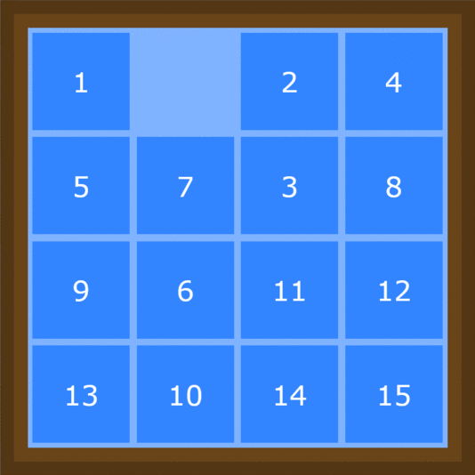
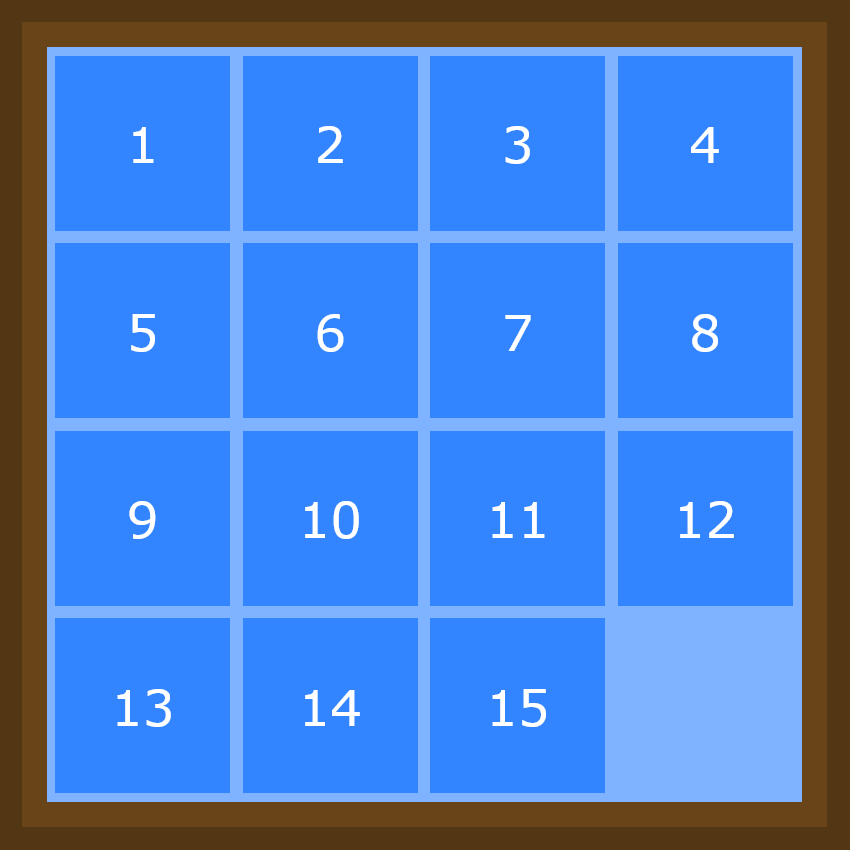

# 15 Puzzle

<br>

<p align="center">
  
</p>

<br>


## Table of contents
* [General Info](#general-info)
* [Libraries](#libraries)
* [Setup](#setup)
* [Sources](#sources)


<br>

## General Info

15 Puzzle is a sliding puzzle that consists of a 4 by 4 grid with 16 square tiles. 15 of the tiles are numbered 1 through 15 in random order and one tile is empty. The goal of the puzzle is to order the tiles from 1-15 by sliding the numbered tiles into the empty tile slot one at a time. The puzzle is complete when it reaches the state in the below picture, referred to as the goal state.


<p align="center">
  
</p>

<br>

The goal of this project is to use search algorithms to find the solution to any given grid position for 15 puzzle and to compare performance measures between the different search algorithms. 


The algorithms used to find solutions are:
* Breadth First Search
* Iterative Deepening Depth First Search
* A Star Search
* Iterative Deepening A Star Search


The measures used to compare performance are:
- number of nodes (grid derivatives) expanded
- memory used (KB)
- time taken (secs)


<br>

## Libraries
* [psutil](https://psutil.readthedocs.io/en/latest/)
* [time](https://docs.python.org/3/library/time.html)
* [os](https://docs.python.org/3/library/os.html)

<br>

## Setup
To run this project:
```
$ pip install time
$ pip install os
$ pip install psutil
$ pip install sys
$ pip install copy
$ cd ../15puzzle
$ py bfs.py
$ py astar.py
```
  
or view the jupyter notebook [here](15puzzle.ipynb)


<br>

## Sources
Artificial Intelligence: A Modern Approach, Third Edition by Stuart Russell and Peter Norvig

