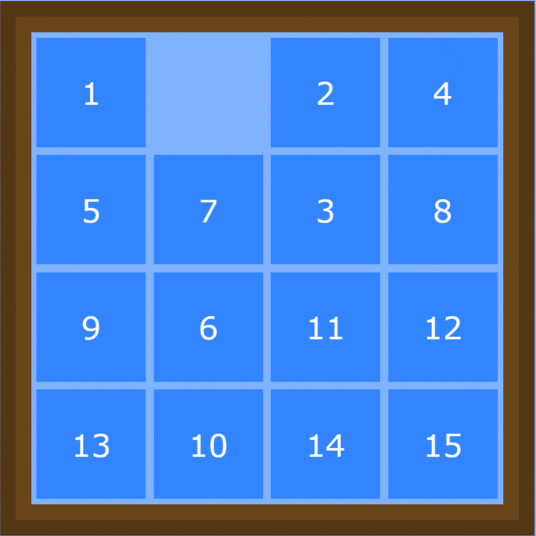

# 15 Puzzle

## Table of contents
* [General info](#general-info)
* [Illustrations](#illustrations)
* [Technologies](#technologies)
* [Setup](#setup)
* [Sources](#sources)

## General info
15 puzzle is is a sliding puzzle that consists of a frame of 16 numbered square tiles from 1 to 15 in random order with one tile missing
15 Puzzle is a sliding puzzle that consists of a frame with 16 square tiles. Fifthteen of the tiles are number 1 through 15 in random order. One tile is empty. The goal of the puzzle is to order the tiles from 1-15. <add image here>


## Illustrations
<p align="center">
  
</p>

## Technologies
* Python 3.7
* pip


## Setup
To run this project:
```
$ pip install time
$ pip install os
$ pip install psutil
$ pip install sys
$ pip install copy
$ cd ../15puzzle
$ py bfs.py
$ py astar.py
```
  
or
  
```
view the notebook [here](15puzzle.ipynb)
```

## Sources

